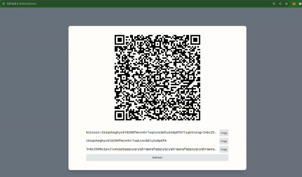

## Simple Bitcoin Wallet Address to QR Generator

This project is the result of completing the [Simple Bitcoin Wallet in Rust tutorial](https://www.youtube.com/watch?v=md-ecvXBGzI).

As stated in my previous [Rustling Exercises repository](https://github.com/Emskiq/rustling-exercises), this is the second step in my learning Rust path: Doing simple to intermediate projects in Rust to enhance my understanding of the language.

I'm actively consolidating my understanding by documenting the functionality and changes made during the development process (with a bit of copy and paste 😅).

---

### Preview


------

### Usage

#### Prerequisites:
- Node.js installed
- npm installed
- Rust installed
- Protoc installed (`apt install protobuf-compiler`)

#### Run the backend

In the main directory of the project:
```bash
cargo run
```
This will build the rust program as long as all the dependencies.

#### Run the front end

In the `frontend` directory of the project run:
```bash
npm install # or pnpm install or yarn install
```
This will install the frontend website, after that you need to run it:
```bash
npm start
```

----

### References and Changes Made

Although Paul from [PlebLabs](https://github.com/PlebLab/PlebLab_Workshops/issues/20) created a fantastic tutorial with a ton of valuable insights and explanations, I encountered issues with the project from the [original repository](https://github.com/futurepaul/paypaul).

Also, I've attempted to _continue_ the tutorial in my README format, sharing my struggles and the materials I've found along the way. 
With that being said, I aim to build on top of the state in which the tutorial ends.

**1) Setup Lighting node**

We want to connect to a lighting node, so we can generate some invoices and render them in the example (spoiler alert it wasn't working smoothly for me). As stated in the begining of the video we will use [Voltage](https://docs.voltage.cloud/) to create our own node and connect to it.

Beforehand, we need a registration in the site. In the time of writting this that service of creating and maintaining a node is not free. 
The good news is that there is 7 days free trial - perfect for the purpose of the project!
Also the whole process of creating you own node is _straight-forward_ and you shouldn't have any problems with it.

**2) Connect to lightning node in Rust**

In the `.env` file created in the video, you need to add the following environment variables.
```rust
let lnd_address = env::var("LND_ADDRESS")?;
let mac_path = env::var("LND_MACAROON_PATH")?;
let tls_path = env::var("LND_TLS_CERT_PATH")?;
```
These are gathered from Voltage. From the [Lighting nodes](https://nodes.voltage.cloud/) part of the site you can easily download the **_admin macaroon_** as well as you **_tls certificate_** files.

The crate [`tonic_lnd`](https://crates.io/crates/tonic_lnd/0.5.1/dependencies) used in the original repo wasn't working for me 😄, so I used its equivielnt in the face of [`fedimint_tonic_lnd`](https://crates.io/crates/fedimint-tonic-lnd).
It is basiaclly the same crate, however the errors regarding miscounted certifacates are fixed.

Exact same way of connecting:
```rust
let client = fedimint_tonic_lnd::connect(lnd_address, tls_path, mac_path)
    .await
    .expect("failed to connect")
    .lightning()
    .clone();
```

**3) AMUX Server part tinkering**

The final touch is within the code of Amux server part:
- `AppState`, which holds the wallet and connection, has been moved to additional module, which I think is more readable.
- `new_address_handler`, which provide the logic of generating new wallet address adding invoice has been reworked:<br>
   Again I have encountered errors with miscounted certificates, so the easy quick fix was just replacing the `bolt11` string with hardcoded one and pass it to the `bip21` function

   ```rust
   let bolt11 = "lnbc2500u1pvjluezpp5qqqsyqcyq5rqwzqfqqqsyqcyq5rqwzqfqqqsyqcyq5rqwzqfqypqdq5xysxxatsyp3k7enxv4jsxqzpuaztrnwngzn3kdzw5hydlzf03qdgm2hdq27cqv3agm2awhz5se903vruatfhq77w3ls4evs3ch9zw97j25emudupq63nyw24cg27h2rspfj9srp".to_string();

   let bip21 = create_bip_21(
      address.address.clone(),
      bolt11.clone(),
      Amount::from_sat(1000),
      "heyo".to_string(),
   );
   ```

**4) Run Everything Together**

This is the easiest and most satisfying part if we are sure everything is fine with the previous parts. Personally, I had a lot of struggle in finalizing the project; however, I certainly learned a lot during the process.

---

_Some resources gathered in the process:_

[Ligthing network overview](https://medium.com/@fulgur.ventures/an-overview-of-lightning-network-implementations-d670255a6cfa)<br>
[Building Lighting Node](https://enigbe.medium.com/building-a-lightning-node-server-and-command-line-interface-cli-2b76fcd06028)<br>
[Macaroons and TLS Certificates Info](https://akshit-modi.medium.com/securing-your-lightning-node-a-deep-dive-into-admin-macaroons-and-tls-certificates-e925f57fb3bc)<br>
[More info on TLS from Voltage](https://voltage.cloud/blog/lightning-network-faq/what-are-tls-certificates-on-lightning-network/#h-lnd-s-tls-certificate)<br>
[Axum Share state](https://docs.rs/axum/latest/axum/extract/struct.State.html)<br>
[Invoices info from Voltage](https://voltage.cloud/blog/lightning-network-faq/understanding-hold-invoices-on-the-lightning-network/)
